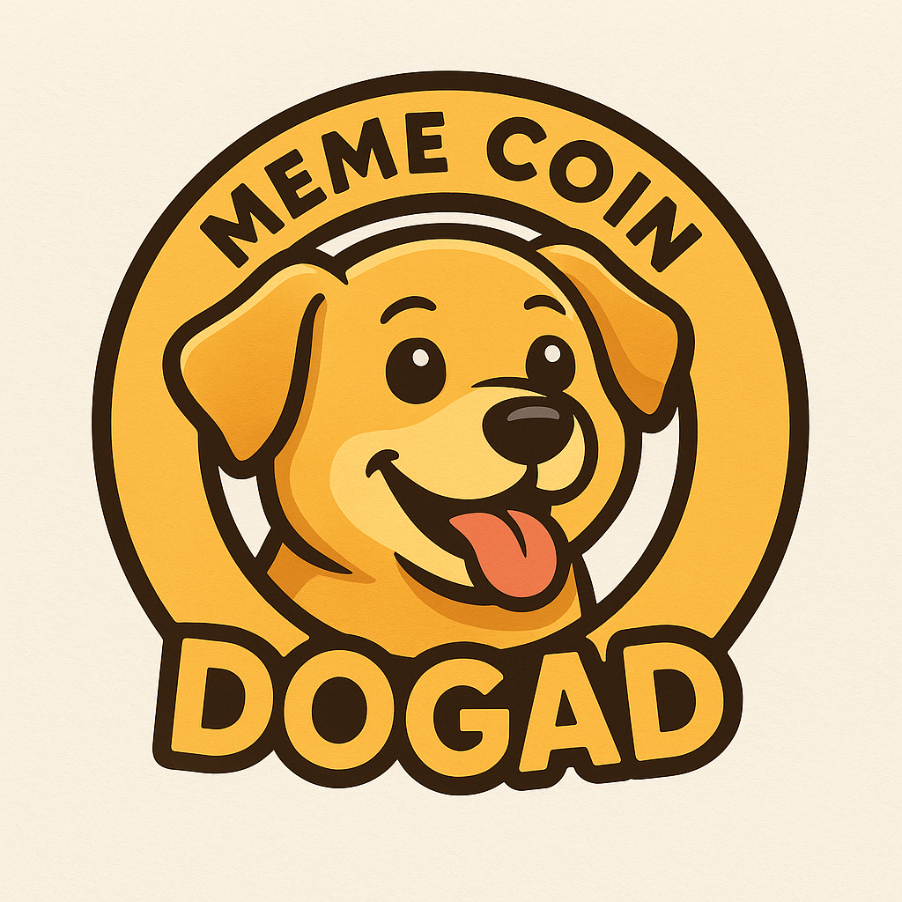

# 🐶 DOGAD — Meme Coin on Monad Chain

DOGAD is a fun meme coin built on **Monad Chain**, created for the Dogbros community.  
Simple, playful, and ready to ride the hype of the upcoming alt season.

---

## 🔗 Smart Contract
`0x06DDd0573198cfB9D7757d92597050d43391a128`

---

## 💱 Buy / Swap
**Uniswap:** *coming soon*

---

## 📊 Tokenomics
- **Total Supply:** 100,000,000,000 DOGAD (100B)  
- **Tax:** 0%  
- **Liquidity:** Locked  
- **Launch:** Fair Launch  

---

## 🗺️ Roadmap

### **Phase 1 — Start**
- Deploy contract  
- DEX listing (Uniswap)  
- Upload logo to GitHub / DexScanner / DEXTools  
- Set up social media (X & TikTok)  

### **Phase 2 — Growth**
- Meme contests  
- Community building (Dogbros)  
- Awareness push across crypto communities  

### **Phase 3 — Expansion**
- Light marketing & small influencers  
- X trending push  
- Listing on small CEX  
- Larger-scale exposure campaigns  

---

## 🌐 Community
- **X/Twitter:** https://x.com/dogad_?s=21  
- **TikTok:** https://www.tiktok.com/@dogad_?_r=1&_t=ZS-91icRZ45JgO  
- **Telegram:** *coming soon*  
- **GitHub:** This repository  

---

## 🤝 About
DOGAD is created for fun, community vibes, and pure meme energy.  
No promises of profit — just good vibes and a journey with the Dogbros 🚀🐶
